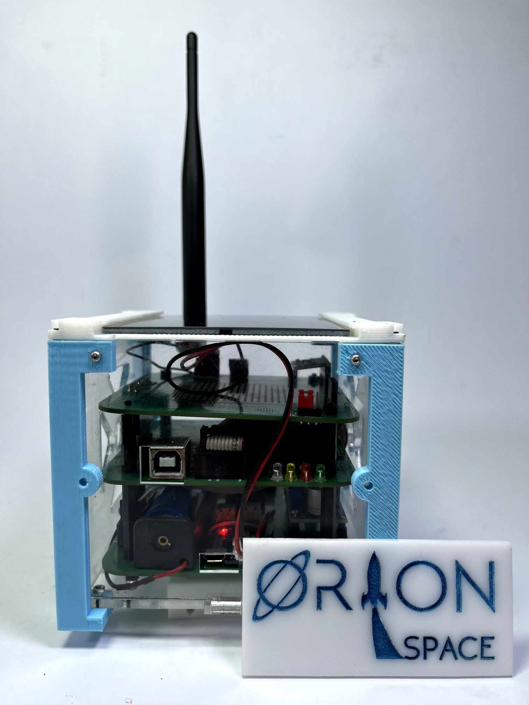
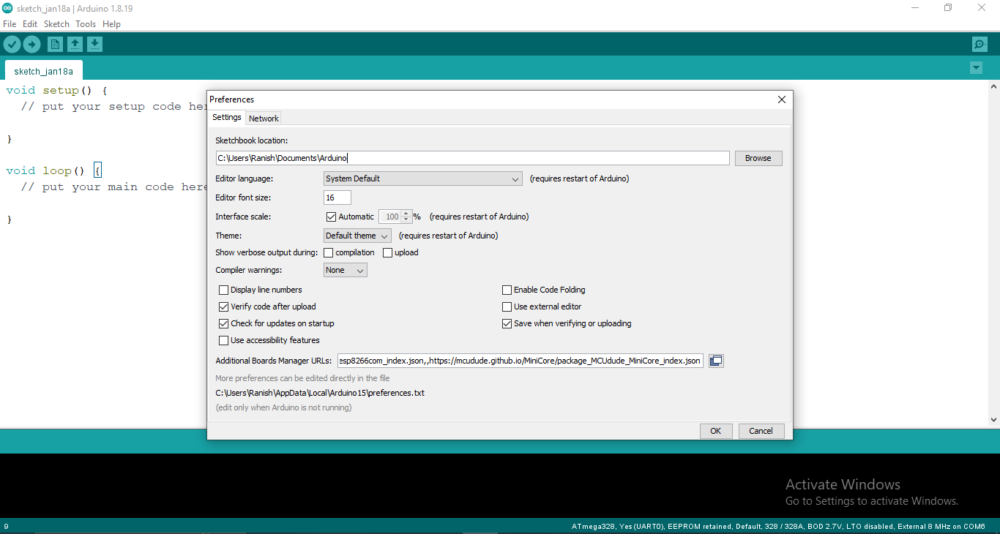
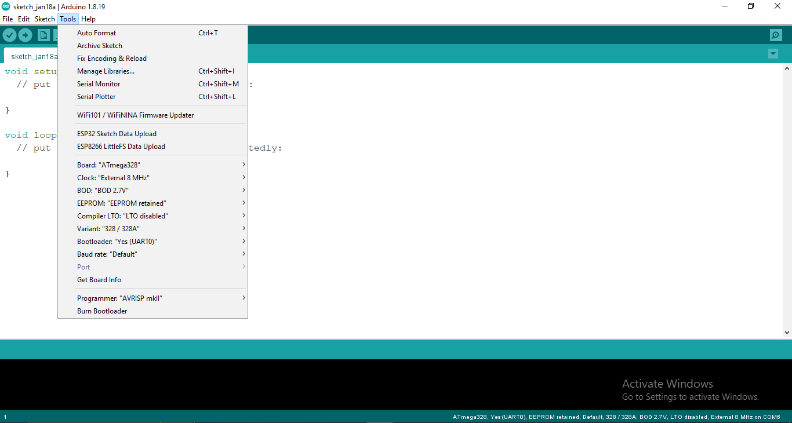

# CUBEEK - A Training Kit for Cube-Sat


CubeSat are tiny box-shaped satellites that are mainly launched into
low Earth orbit to observe the Earth, test new communications
technology or perform miniature experiments.

The basic CubeSat design is a cube 10 cm x 10 cm x 10 cm in size and
is called 1U (standing for ‘one unit’). It is similar in size to a standard
Rubik’s Cube. The mass of 1U is not allowed to be greater than 1.33
kg.

## Modules used in CUBEEK
Housekeeping Sensor:
* INA219

Modules that are used for Payload:
* GPS
* BMP085
* MPU6050
* Temt6000
* Dallas Temperature Sensor

The communication module:
* LORA (RA-02)

## Libraries Required
Download and add these libraries in order to run CUBEEK software properly. Follow the respective link to download them.
1. LORA: [click here](https://github.com/sandeepmistry/arduino-LoRa)
2. GPS: [click here](https://github.com/mikalhart/TinyGPSPlus.git)
3. BMP085: [click here](https://github.com/adafruit/Adafruit-BMP085-Library.git)
4. BusIO: [click here](https://github.com/adafruit/Adafruit_BusIO) (library for I2C abstraction for bmp085)

## Software Required
Download software from following their links.
1. Arduino IDE: [click here](https://www.arduino.cc/en/software)
2. FT232R Driver: [click here](https://ftdichip.com/drivers/vcp-drivers/)

## Boards Required (Incase you don't have normal Arduino Pro-mini)
Download and add these Boards in order to run CUBEEK software properly. Follow the respective link to download them.
1. Add this link to the preference section of your Arduino IDE.

    File --> Preferences
    ```
    https://mcudude.github.io/MiniCore/package_MCUdude_MiniCore_index.json 
    ```
    
2. Install the MiniCore board from board manager.

    Tools --> Board --> Board Manager...
    
    
3. Select all the setting according to given image. (Don't forget to add port.)

    