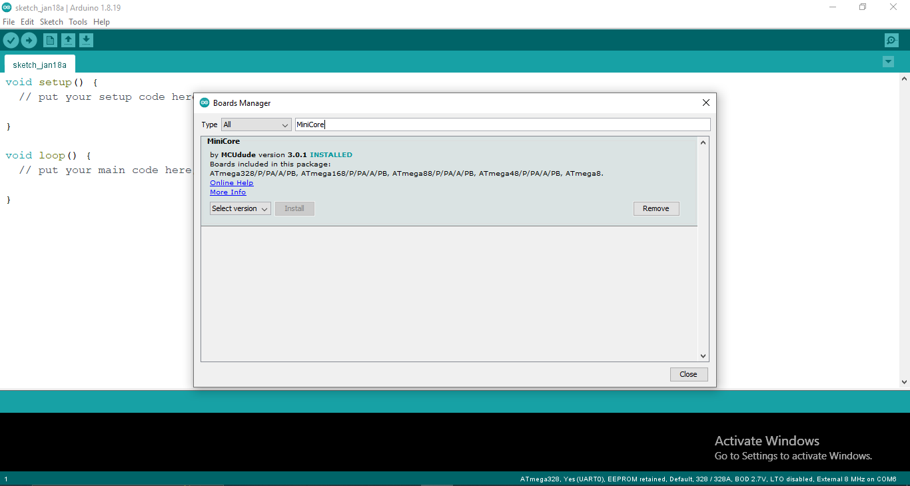

# CUBEEK - A Training Kit for Cube-Sat


CubeSat are tiny box-shaped satellites that are mainly launched into
low Earth orbit to observe the Earth, test new communications
technology or perform miniature experiments.

The basic CubeSat design is a cube 10 cm x 10 cm x 10 cm in size and
is called 1U (standing for ‘one unit’). It is similar in size to a standard
Rubik’s Cube. The mass of 1U is not allowed to be greater than 1.33
kg.

## Modules used in CUBEEK
Housekeeping Sensor:
* INA219

Modules that are used for Payload:
* GPS
* BMP085
* MPU6050
* Temt6000
* Dallas Temperature Sensor

The communication module:
* LORA (RA-02)

## Libraries Required
Download and add these libraries in order to run CUBEEK software properly. Follow the respective link to download them.
1. INA219: [click here](https://github.com/adafruit/Adafruit_INA219)
1. Dallas Temperature Sensor: [click here](https://github.com/milesburton/Arduino-Temperature-Control-Library)
1. LORA: [click here](https://github.com/sandeepmistry/arduino-LoRa)
2. GPS: [click here](https://github.com/mikalhart/TinyGPSPlus.git)
3. BMP085: [click here](https://github.com/adafruit/Adafruit-BMP085-Library.git)
4. BusIO: [click here](https://github.com/adafruit/Adafruit_BusIO) (library for I2C abstraction for bmp085)

## Software Required
Download software from following their links.
1. Arduino IDE: [click here](https://www.arduino.cc/en/software)
2. FT232R Driver: [click here](https://ftdichip.com/drivers/vcp-drivers/)

# Steps For Visualizing data in Dashboard
 Clone the repo from the link and save it.

Navigate to `Cubeek-Dashboard.` You shall see 3 directories as:

## 1. Cubeek_Softwares :- 
Here you shall find different test codes for uploading to your CUBEEK's MCU.

- Cubeek_for_dashboard : Intended to get and format data to transmit for Dashboard that get visualization at Ground station.
    - Note: This is the software you shall  upload in your Cubeek's MCU for Visualizing data in Dashboard
- cubeek_for_OLED : Intended to format and display data at ground station's OLED display (If used).
- Cubeek_for_serial_monitor : intended as generic code that is display at serial monitor of IDE.
## 2. Dashboard:- 
Here are setup procedure for visualization of your data in form of graphs.
1. Install the NodeJs as given

2. Navigate to Ground Station and you shall see the files as below.

3. Navigate to :`Dashboard -> Ground Station`.
4. Open Command Prompt in this folder. 
    - Note : You can open it with just clibking to nav-bar in windows and type cmd to open the command prompt at given location or alternatively open it and navigate to the location with `CD <Dir>`
5. Install `npm` via Command `npm install` in  command Prompt as shown 

This will Install your dependencies to run node files 
    - Note:- If you have already install npm you can follow the command given by node to resolve issues. Some common commands are like `npm audit fix` and `npm fund`.
6. Now run the Server at your computer by entering `node server.js` command at your cmd prompt.


7. Now open your Browser and Visit [localhost](http://localhost:4000/).

    - This will open the dashboard as shown below.


8. Now chose the `COM` port for your Ground Station and you can see data both througn the command and being plotted in your respective Charts.

9. You shall always find your data logged  in `dataarray.json` in same file which can be imported and analyzed later. 
    - Note: make sure to rename the name of dataarray.json to any other each time to avoid overwritting of data.
## 3. Ground_Station_Softwares:- 
Here you shall find different test codes for uploading to your Ground Station. These Ground Station are required to be connected in your computer during process of receiving data.


    ` Cubeek Ground Station`
- GND_STA_For_Dashboard_and_Serial : Intended to format the data for displaying in both dashboard or in Serial Monitor.

    - Note: This is the code you are supposed to upload in your Ground Station Connected to your Computer for Visualization Graphs in Dashboard.

- Ground_Station_for_OLED : Intended to format and display data at OLED display (If used).

## Boards Required (Incase you don't have normal Arduino Pro-mini)
Download and add these Boards in order to run CUBEEK software properly. Follow the respective link to download them.
1. Add this link to the preference section of your Arduino IDE.

    File --> Preferences
    ```
    https://mcudude.github.io/MiniCore/package_MCUdude_MiniCore_index.json 
    ```
    
2. Install the MiniCore board from board manager.

    Tools --> Board --> Board Manager...
    
    
3. Select all the setting according to given image. (Don't forget to add port.)

    